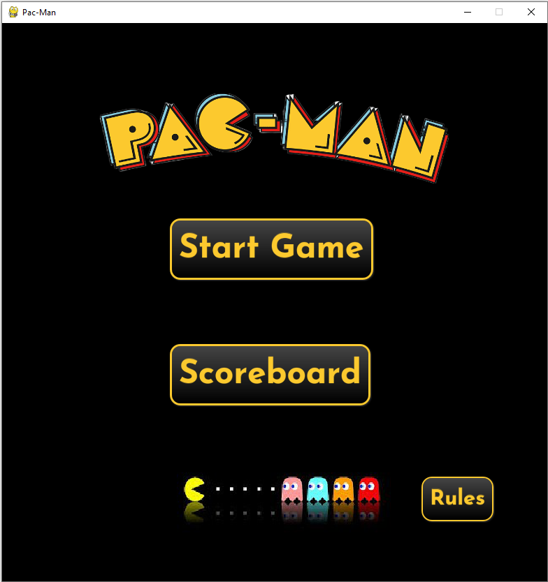
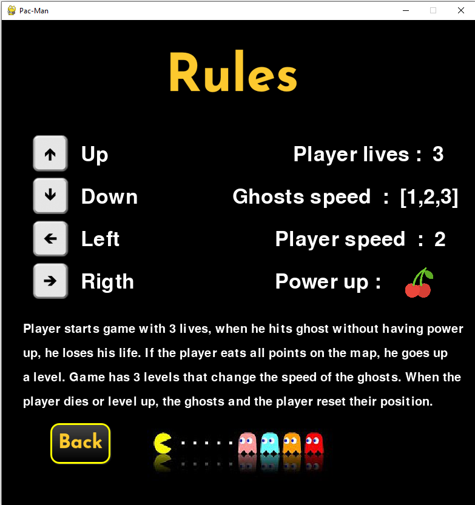
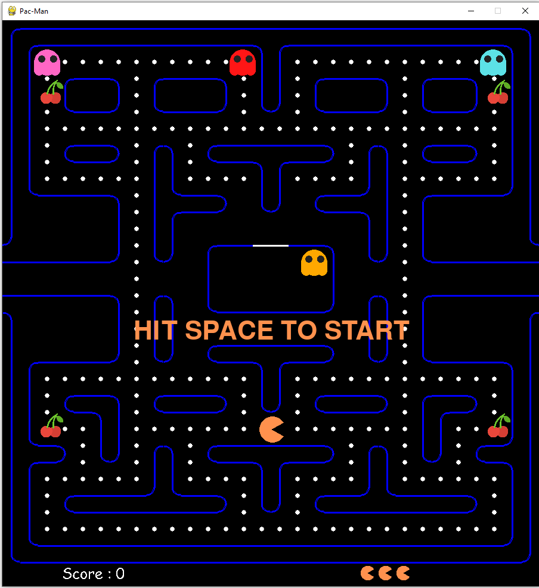
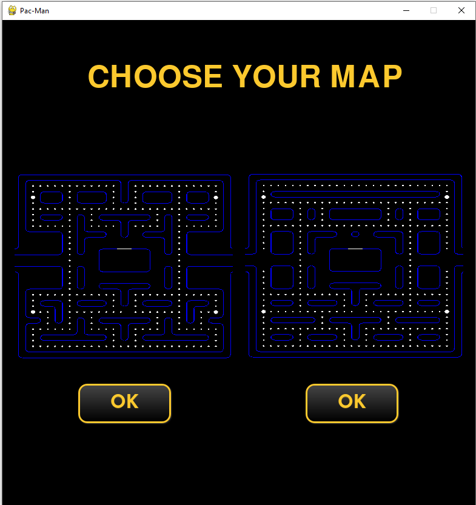

## Pac-Man

Pac-Man is a classic game created in Python using the Pygame library. The objective of the game is to control the character Pac-Man, who must eat as many points on the board as possible while avoiding ghosts. The player starts with three lives and must stay alive as long as possible while collecting as many points as possible.



## Game Rules




 - Game Objective : 
 The objective of the game is to earn as many points as possible by eating the points on the board. The game consists of multiple levels, and the player advances to the next level after eating all the points on the board.

 - Controls : 
 Arrow keys (up, down, left, right) - control Pac-Man.

 - Points : 
 Small points - Players earn points by eating the small points scattered across the board.

 

Cherries - Cherries are power-ups that allow Pac-Man to eat ghosts. After eating a cherry, the ghost is moved to the center of the board and can reappear on the board after a few seconds.

- Lives : 
The player starts with three lives. A life is lost if Pac-Man is eaten by a ghost. After losing all lives, the game ends.

- Levels : 
After eating all the points on the board, the player advances to the next level. Each successive level is more challenging, with ghosts becoming faster and the game becoming more demanding.

- Maps : 
The Pac-Man project includes two available maps to choose from. Players can select between them when starting the game.


## Installation

1. Clone the repo
```bash
git clone https://github.com/janmark101/PacMan-Python.git
```

2. Make sure you have the Pygame library installed. If not, you can install it using the following command:

```bash
pip install pygame
```

3. Open 'PacManPython' directory with you IDE.

4. Run file 'main.py'
